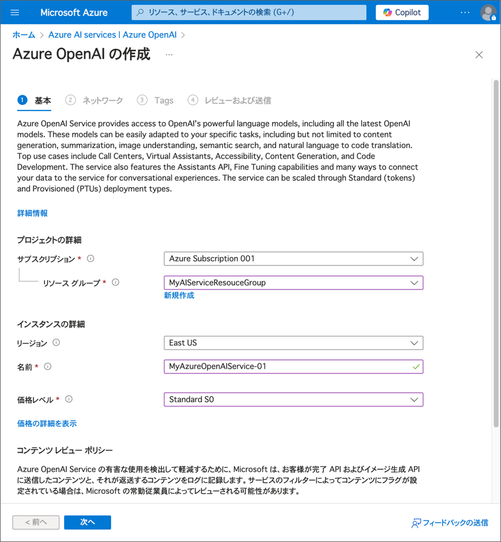
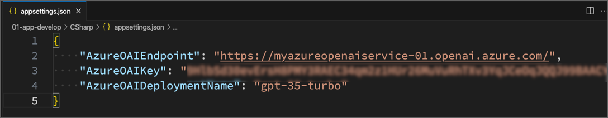
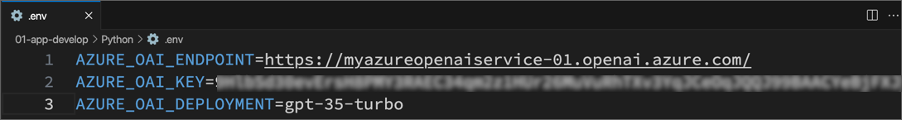
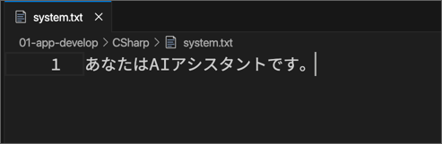
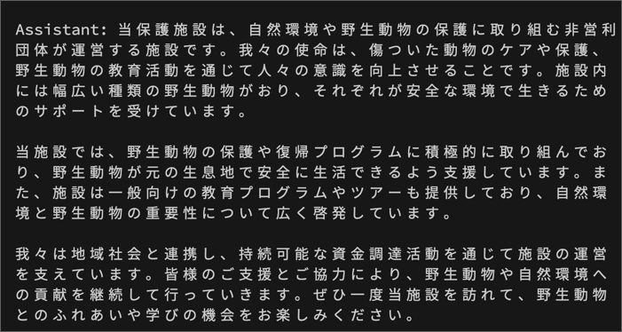
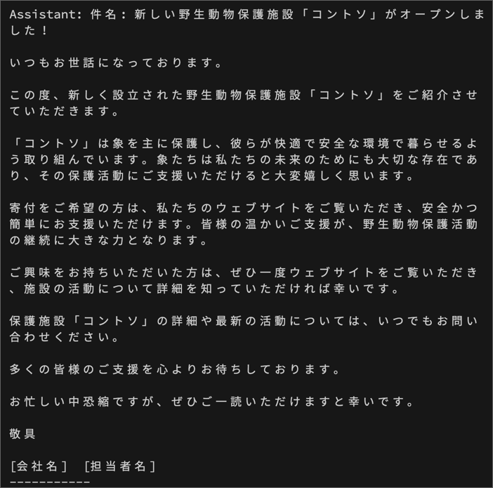
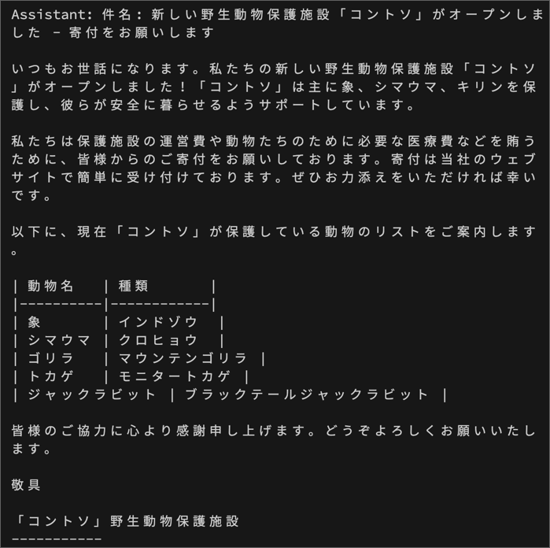
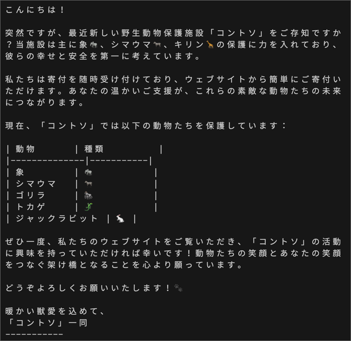
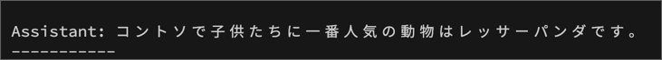

---
lab:
    title: 'Azure OpenAI Service を使用してアプリケーションを開発する'
---

# Azure OpenAI Service を使用したアプリケーション開発

Azure OpenAI Service を使うと、開発者は自然な人間の言葉を理解するチャットボットや他のアプリケーションを作成できます。これには REST API や特定の言語用 SDK を使用します。これらの言語モデルを使うとき、開発者がどのようにプロンプト（指示文）を作るかが、AI モデルの応答に大きな影響を与えます。Azure OpenAI モデルは、明確で簡潔な指示を受けると、内容を調整したりフォーマットしたりすることができます。この演習では、アプリケーションを Azure OpenAI に接続する方法を学び、同じ内容に対する異なるプロンプトが、AI モデルの応答をどのように変えるかを確認します。

この演習のシナリオでは、あなたは野生動物のマーケティングキャンペーンに取り組むソフトウェア開発者の役割を果たします。生成 AI を使って広告メールを改善したり、チームに役立つ記事を分類したりする方法を探ります。この演習で使用するプロンプトエンジニアリングの技術は、さまざまな用途に同様に適用できます。

この演習の所要時間は約 **30** 分です。

## Azure OpenAI リソースを作成する

まだ Azure OpenAI リソースを持っていない場合は、Azure サブスクリプションに新しく作成しましょう。

1. **Azure ポータル** (`https://portal.azure.com`) にサインインします。

1. 次の設定で **Azure OpenAI** リソースを作成します:
    - **サブスクリプション**: *Azure OpenAI サービスへのアクセスが承認された Azure サブスクリプションを選択します*
    - **リソースグループ**: *既存のリソースグループを選択するか、新しく作成します*
    - **リージョン**: *以下のリージョンから**ランダム**に選択します*\*
        - Canada East
        - East US
        - East US 2
        - France Central
        - Japan East
        - North Central US
        - Sweden Central
        - Switzerland North
        - UK South
    - **名前**: *任意の一意の名前を入力します*
    - **価格レベル**: Standard S0

    > \* Azure OpenAI リソースはリージョンごとに使用制限があります。このリストのリージョンには、この演習で使用するモデルタイプのデフォルトの使用制限が含まれています。ランダムにリージョンを選ぶことで、他のユーザーとサブスクリプションを共有している場合に、特定のリージョンの使用制限に達するリスクを減らすことができます。演習の途中で使用制限に達した場合は、別のリージョンに新しいリソースを作成する必要があるかもしれません。

    

3. デプロイが完了するのを待ちます。その後、Azure ポータルでデプロイされた Azure OpenAI リソースに移動します。

## モデルをデプロイする

次に、CLI を使用して Azure OpenAI モデルリソースをデプロイします。以下の例を参考にして、上記の自分の値に置き換えてください。

```dotnetcli
az cognitiveservices account deployment create \
   -g *Your resource group* \
   -n *Name of your OpenAI service* \
   --deployment-name gpt-35-turbo \
   --model-name gpt-35-turbo \
   --model-version 0125  \
   --model-format OpenAI \
   --sku-name "Standard" \
   --sku-capacity 5
```

    > \* sku-capacity は 1 分あたりのトークン数で測定されます。1 分あたり 5,000 トークンのレート制限は、この演習を完了するのに十分な値です。また、同じサブスクリプションを使用している他の人のための容量も残すことができます。

> [!注意]
> この演習中に net7.0 フレームワークがサポート外であるという警告が表示されることがありますが、無視してかまいません。

## アプリケーションを設定する

アプリケーションは C# と Python の両方で提供されており、どちらのアプリも同じ機能を持っています。まず、非同期 API 呼び出しを使用して Azure OpenAI リソースを利用できるように、アプリケーションの重要な部分を完成させます。

1. Visual Studio Code の **エクスプローラー** ペインで、**Labfiles/01-app-develop** フォルダーに移動し、言語の好みに応じて **CSharp** または **Python** フォルダーを展開します。各フォルダーには、Azure OpenAI 機能を統合するための言語固有のファイルが含まれています。
2. コードファイルが含まれている **CSharp** または **Python** フォルダーを右クリックして、統合ターミナルを開きます。次に、言語に対応したコマンドを実行して Azure OpenAI SDK パッケージをインストールします。
   
    **C#**:

    ```
    dotnet add package Azure.AI.OpenAI --version 2.0.0
    ```

    **Python**:

    ```
    pip install openai==1.54.3
    ```

3. **エクスプローラー** ペインで、**CSharp** または **Python** フォルダーに移動し、言語に応じた設定ファイルを開きます。

    - **C#**: appsettings.json
    - **Python**: .env

4. 設定ファイルの値を次のように変更してください。
    - 作成した Azure OpenAI リソースから取得した **エンドポイント** と **キー**（Azure ポータルの **キーとエンドポイント** ページで確認できます）
    - モデルデプロイメントのために指定した **デプロイメント名**
  
        *appsessings.json*
        

        *.env*
        

5. 設定ファイルを保存します。

## Azure OpenAI サービスを使用するコードを追加する

これで、デプロイしたモデルを利用するために Azure OpenAI SDK を使用する準備が整いました。

1. **エクスプローラー** ペインで、**CSharp** または **Python** フォルダーに移動し、好みの言語のコードファイルを開きます。そして、コメント ***Add Azure OpenAI package*** を Azure OpenAI SDK ライブラリを追加するコードに置き換えます。
   
    **C#**: Program.cs

    ```csharp
    // Add Azure OpenAI packages
    using Azure.AI.OpenAI;
    using OpenAI.Chat;
    ```

    **Python**: application.py

    ```python
    # Add Azure OpenAI package
    from openai import AsyncAzureOpenAI
    ```

2. コードファイルで、コメント ***Configure the Azure OpenAI client*** を見つけて、Azure OpenAI クライアントを設定するコードを追加します。

    **C#**: Program.cs

    ```csharp
    // Configure the Azure OpenAI client
       AzureOpenAIClient azureClient = new (new Uri(oaiEndpoint), new ApiKeyCredential(oaiKey));
        ChatClient chatClient = azureClient.GetChatClient(oaiDeploymentName);
        ChatCompletion completion = chatClient.CompleteChat(
        [
        new SystemChatMessage(systemMessage),
        new UserChatMessage(userMessage),
        ]);
    ```

    **Python**: application.py

    ```python
    # Configure the Azure OpenAI client
    client = AsyncAzureOpenAI(
        azure_endpoint = azure_oai_endpoint, 
        api_key=azure_oai_key,  
        api_version="2024-02-15-preview"
        )
    ```

3. Azure OpenAI モデルを呼び出す関数で、コメント ***Get response from Azure OpenAI*** の下に、リクエストをフォーマットしてモデルに送信するコードを追加します。
   
    **C#**: Program.cs

    ```csharp
    // Get response from Azure OpenAI
    Console.WriteLine($"{completion.Role}: {completion.Content[0].Text}");

    ```

    **Python**: application.py

    ```python
    # Get response from Azure OpenAI
    messages =[
        {"role": "system", "content": system_message},
        {"role": "user", "content": user_message},
    ]
    
    print("\nSending request to Azure OpenAI model...\n")

    # Call the Azure OpenAI model
    response = await client.chat.completions.create(
        model=model,
        messages=messages,
        temperature=0.7,
        max_tokens=800
    )
    ```

4. コードファイルの変更を保存します。

## アプリケーションを実行する

アプリケーションの設定が完了したので、実行してモデルにリクエストを送り、応答を確認しましょう。異なるオプションの違いはプロンプトの内容だけで、他のパラメーター（トークン数や温度など）は各リクエストで同じです。

1. 好みの言語のフォルダーで、Visual Studio Code で `system.txt` を開きます。インタラクション毎に、このファイルに **システムメッセージ** を書き込んで保存してください。各インタラクションでは、あなたがシステムメッセージを変更できるように、毎回一時停止します。

    

2. **エクスプローラー**ペインで、好きな言語のフォルダーの上で右クリックし、**統合ターミナルで開く**を選択します。統合ターミナルでは、以下のコマンドを入力し、アプリケーションを実行します。

    - **C#**: `dotnet run`
    - **Python**: `python application.py`

    > **ヒント**: ターミナルツールバーの **パネルサイズを最大化** (**^**) アイコンを使うと、コンソールのテキストをもっと見ることができます。

3. 最初のステップとして、次のプロンプトを入力してください。

    **システムメッセージ** (system.txt に書き込む文字列)

    ```prompt
    あなたはAIアシスタントです。
    ```

    **ユーザーメッセージ:**

    ```prompt
    新しい野生動物保護施設の紹介文を書いてください。
    ```

4. 出力を確認しましょう。AI モデルは、一般的にありそうな野生動物保護施設のいい感じの紹介文を生成するでしょう。

    *応答例*
    

5. 次に、応答の形式を指定する以下のプロンプトを入力します。
   
    **システムメッセージ**

    ```prompt
    あなたはメールを書くのを手伝うAIアシスタントです。
    ```

    **ユーザーメッセージ:**

    ```prompt
    新しい野生動物保護施設の宣伝メールを書いてください。以下の内容を含めてください。
    - 保護施設の名前は「コントソ」です。
    - 主に象を保護しています。
    - 寄付は私たちのウェブサイトで受け付けています。
    ```

    > **ヒント**: Skillableを使用している場合、VMでの自動入力が複数行のプロンプトにうまく対応しない場合があります。その場合は、プロンプト全体をコピーしてVisual Studio Codeに貼り付けてください。


6. 出力を確認しましょう。今回は、特定の動物が含まれたメールの形式や寄付の呼びかけが表示されるでしょう。

   *応答例*
   

7. 次に、以下のプロンプトを入力してみてください。これらは内容をさらに具体的に指定します。

    **システムメッセージ**

    ```prompt
    あなたはメールを書くのを手伝うAIアシスタントです。
    ```

    **ユーザーメッセージ:**

    ```prompt
    新しい野生動物保護施設の宣伝メールを書いてください。以下の内容を含めてください。
    - 保護施設の名前は「コントソ」です。
    - 主に象、シマウマ、キリンを保護しています。
    - 寄付は私たちのウェブサイトで受け付けています。
    署名の後に、現在保護している動物のリストを表形式で含めてください。これらの動物には、象、シマウマ、ゴリラ、トカゲ、ジャックラビットが含まれます。
    ```

8. 出力を確認し、明確な指示に基づいてメールがどのように変わったかを見てみましょう。
   
    *応答例*
    

9.  次に、システムメッセージにトーン（口調）についての詳細を追加して、以下のプロンプトを入力してみましょう。
    
    **システムメッセージ**

    ```prompt
    あなたは、新しいビジネスに興味を持ってもらうためのプロモーションメールを書くのを手伝うAIアシスタントです。あなたのトーンは軽快で、話し上手で、必ず少なくとも2つのジョークを含めます。
    ```

    **ユーザーメッセージ:**

    ```prompt
    新しい野生動物保護施設の宣伝メールを書いてください。以下の内容を含めてください。
    - 保護施設の名前は「コントソ」です。
    - 主に象、シマウマ、キリンを保護しています。
    - 寄付は私たちのウェブサイトで受け付けています。
    署名の後に、現在保護している動物のリストを表形式で含めてください。これらの動物には、象、シマウマ、ゴリラ、トカゲ、ジャックラビットが含まれます。
    ```
10. 出力を確認しましょう。今回は、メールの形式は似ていますが、よりカジュアルなトーンで、ジョーク（？）も含まれているでしょう。
    
    *応答例*
     

11. 最後のステップでは、メール生成から少し離れて、「グラウンディングコンテキスト」を試してみます。ここでは、シンプルなシステムメッセージを提供し、アプリを変更してユーザープロンプトの最初にグラウンディングコンテキストを追加します。アプリはその後、ユーザー入力を追加し、グラウンディングコンテキストから情報を抽出してユーザープロンプトに答えます。
    
12. `grounding.txt` ファイルを開き、挿入するグラウンディングコンテキストの内容を少し読んでみてください。

13. アプリで、コメント ***Format and send the request to the model*** の直後、既存のコードの前に、次のコードスニペットを追加して `grounding.txt` からテキストを読み込み、ユーザープロンプトにグラウンディングコンテキストを追加します。

    **C#**: Program.cs

    ```csharp
    // Format and send the request to the model
    Console.WriteLine("\nAdding grounding context from grounding.txt");
    string groundingText = System.IO.File.ReadAllText("grounding.txt");
    userMessage = groundingText + userMessage;
    ```

    **Python**: application.py

    ```python
    # Format and send the request to the model
    print("\nAdding grounding context from grounding.txt")
    grounding_text = open(file="grounding.txt", encoding="utf8").read().strip()
    user_message = grounding_text + user_message
    ```
13. ファイルを保存して、アプリを再実行します。
14. 次のプロンプトを入力します（**システムメッセージ**は引き続き `system.txt` に入力して保存します）。

    **システムメッセージ**

    ```prompt
    あなたは情報を探すのを手伝うAIアシスタントです。プロンプトに提供されたテキストから答えを提供し、簡潔に答えます。
    ```

    **ユーザーメッセージ:**

    ```prompt
    コントソで子供たちに一番人気の動物は何ですか？
    ```

    > **ヒント**: Azure OpenAI からの完全な応答を見たい場合は、**printFullResponse** 変数を `True` に設定して、アプリを再実行してください。

    *応答例*
    

## クリーンアップ

Azure OpenAI リソースの使用が終わったら、**Azure ポータル** (`https://portal.azure.com`) で忘れずにデプロイメントおよびリソース全体を削除してください。
